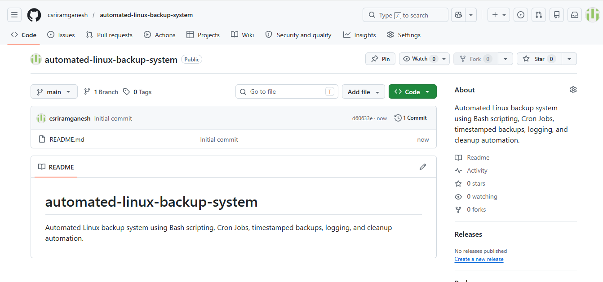
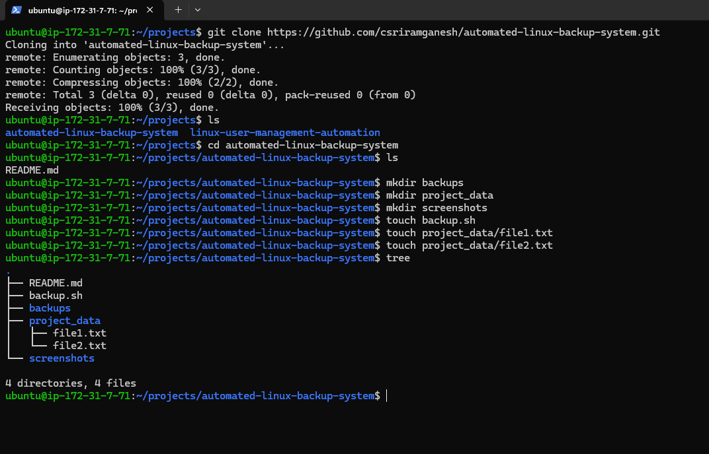
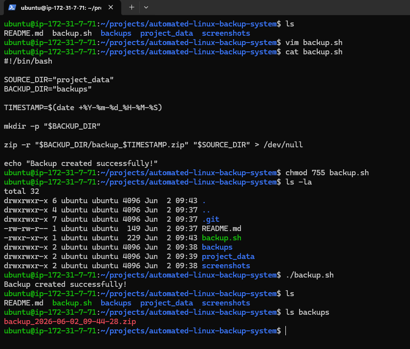
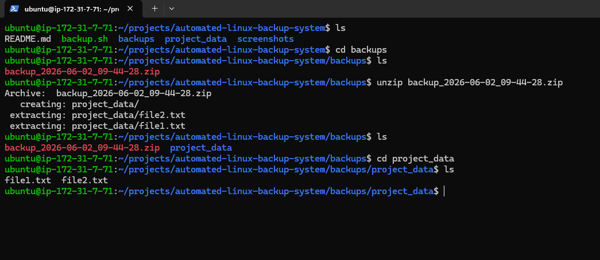
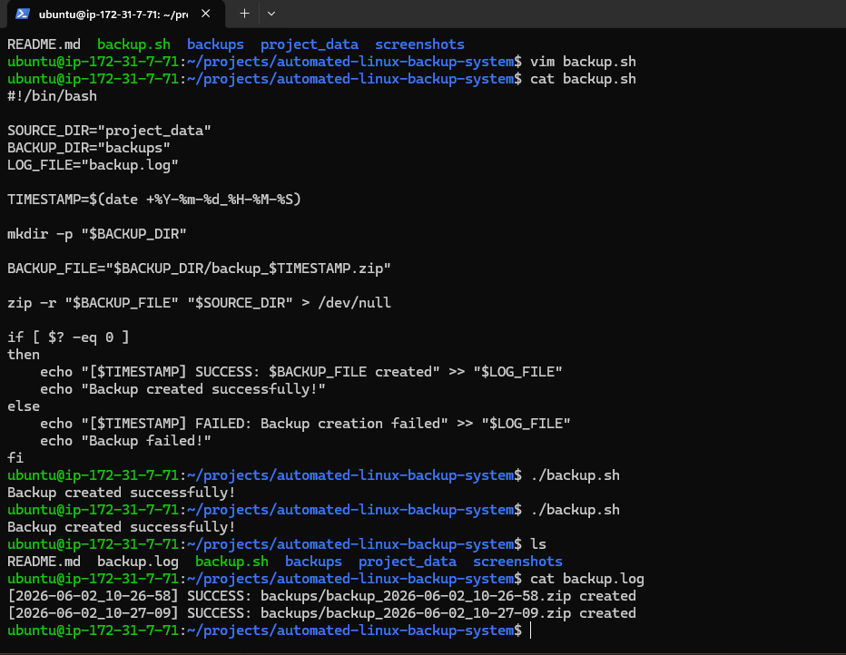
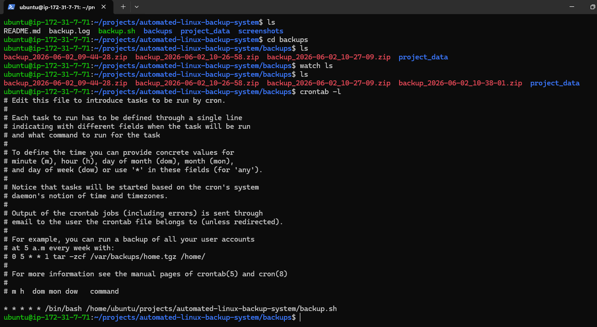
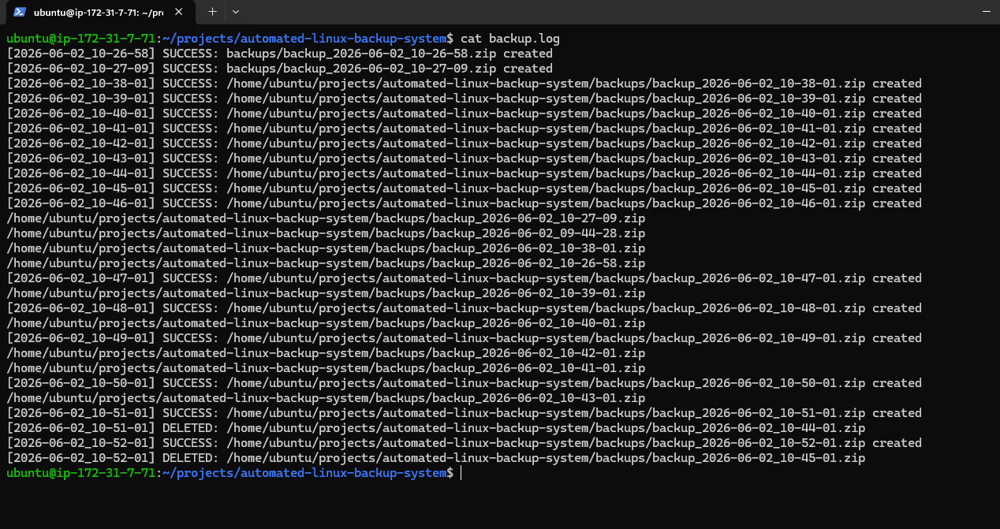
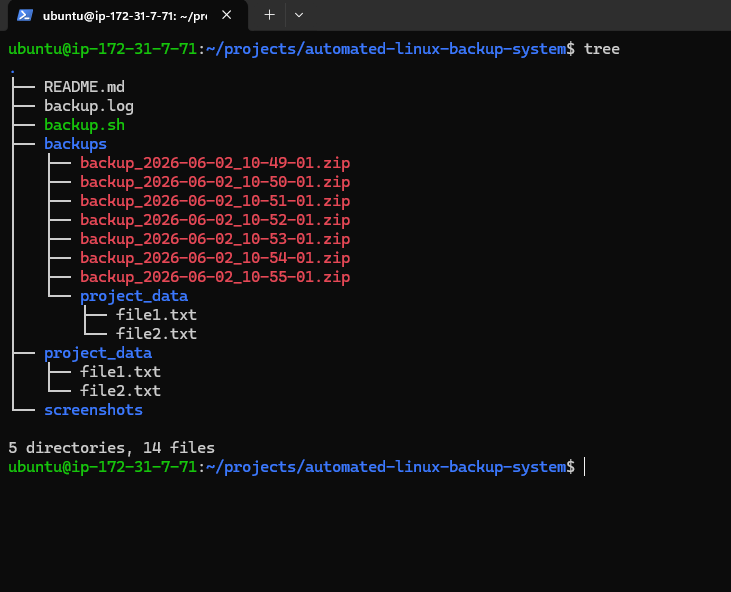

# Automated Linux Backup System

A Bash scripting project that automates Linux backups using ZIP archives, Cron Jobs, logging, and automatic cleanup of old backups.

## Project Overview

This project demonstrates how to build a simple backup automation solution commonly used in Linux environments.

The script:

- Creates timestamp-based ZIP backups
- Stores backups in a dedicated directory
- Generates backup logs
- Runs automatically using Cron Jobs
- Removes old backups automatically

---

## Features

✅ Automated ZIP backups

✅ Timestamp-based backup naming

✅ Backup logging

✅ Cron Job scheduling

✅ Automatic cleanup of old backups

✅ Backup verification

---

## Technologies Used

- Bash Scripting
- Linux
- Cron Jobs
- ZIP Utility
- Find Command
- Git & GitHub

---

## Project Structure

```text
automated-linux-backup-system
├── backup.sh
├── backup.log
├── backups
├── project_data
├── screenshots
└── README.md
```

---

## How It Works

### Step 1: Create Backup

The script creates a timestamp and generates a ZIP archive of the target directory.

Example:

```bash
backup_2026-06-02_16-30-15.zip
```

### Step 2: Log Backup Activity

Every successful backup is recorded in:

```text
backup.log
```

Example:

```text
[2026-06-02_16-30-15] SUCCESS: backup created
```

### Step 3: Automated Scheduling

Cron executes the backup script automatically.

Demo schedule:

```cron
* * * * * /path/to/backup.sh
```

Production example:

```cron
0 1 * * * /path/to/backup.sh
```

### Step 4: Cleanup Old Backups

Old backup files are automatically removed.

Demo version:

```bash
find "$BACKUP_DIR" -type f -name "*.zip" -mmin +7 -delete
```

Production version:

```bash
find "$BACKUP_DIR" -type f -name "*.zip" -mtime +7 -delete
```

---

## Installation

Clone the repository:

```bash
git clone https://github.com/YOUR_USERNAME/automated-linux-backup-system.git
cd automated-linux-backup-system
```

Make the script executable:

```bash
chmod +x backup.sh
```

Run the script:

```bash
./backup.sh
```

---

## Screenshots

### 1. GitHub Repository Created



### 2. Project Structure Created



### 3. Backup Script and Execution



### 4. Backup Verification



### 5. Logging Functionality



### 6. Cron Job Configuration



### 7. Cleanup Logic



### 8. Final Project Structure



---

## Learning Outcomes

Through this project I practiced:

- Bash scripting fundamentals
- Linux file management
- ZIP archive creation
- Cron Job automation
- Log generation and monitoring
- Backup retention policies
- Git and GitHub workflow

---

## Future Enhancements

- Store backups in Amazon S3
- Email backup reports
- Restore automation script
- Configuration file support
- Backup compression options

---

## Author

**Sriram Ganesh**


